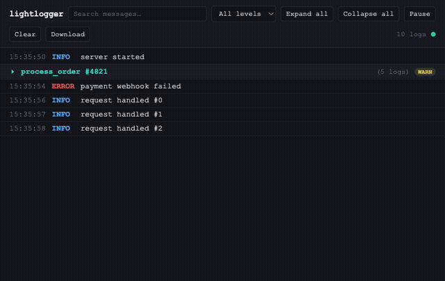

# lightlogger

Live web dashboard for your Python logs — pip install, add one line, open localhost:4356. Zero dependencies.

[](https://pypi.org/project/lightlogger/)
[](https://github.com/Rahuwale123/lightlogger/actions/workflows/ci.yml)
[](LICENSE)
[](pyproject.toml)



## Install

```bash
pip install lightlogger
```

```python
import lightlogger
lightlogger.start()
lightlogger.info("user logged in")
```

That's it — open `http://127.0.0.1:4356` and watch it stream in live, in a dark, searchable dashboard. No config file, no separate server process to run, no npm install.

Your existing `logging` calls show up too, with zero code changes:

```python
lightlogger.start(capture_logging=True)  # the default
import logging
logging.getLogger("some.third.party.lib").warning("disk almost full")  # appears in the UI automatically
```

And when one log message is really four related operations, group them:

```python
with lightlogger.group("process_order #4821"):
    lightlogger.info("validating cart")
    lightlogger.info("charging payment", data={"amount": 49.99})
    with lightlogger.group("send_notifications"):
        lightlogger.info("email sent")
        lightlogger.info("sms sent")
```

They render as a collapsible tree — click to expand, nested groups indent, a red badge appears if anything inside failed.

## Features

| | |
|---|---|
| **Live streaming** | Server-Sent Events, not polling — logs appear the instant they're written |
| **Zero-code `logging` capture** | Attaches to the root logger; your own and third-party libraries' logs show up automatically |
| **Nested log grouping** | `with lightlogger.group(name):` — collapsible, nested, thread- and async-safe |
| **Search & level filter** | Client-side, instant, works across grouped and ungrouped logs alike |
| **Pause / Resume** | Freeze the view to read something — nothing is dropped, a counter shows what's waiting |
| **Click to expand** | File, line, logger name, and pretty-printed JSON data for any entry |
| **Download as JSON** | One click, the full current backlog |
| **Bounded memory** | A fixed-size ring buffer — lightlogger can never be the reason your app runs out of RAM |
| **Zero dependencies** | Python standard library only, from the HTTP server to the JSON encoding |

## Why lightlogger

Debugging a running Python process usually means one of three things: `print()` statements you'll forget to remove, a terminal window full of scrolling text you can't search, or reaching for a heavyweight observability platform to answer a question that takes ten seconds to answer once you can actually *see* your logs.

We looked at what else exists. [Logdy](https://logdy.dev/) is a Go binary you install separately from your app. [Chronologer](https://github.com/nkconnor/chronologer) needs its own server process. [cutelog](https://github.com/busimus/cutelog) needs PyQt. Logfire is closed-source and cloud-hosted. `lnav` and `klp` are terminal-only. Django and Flask debug toolbars only work inside those specific frameworks, in that specific request/response cycle.

None of them do the one thing that actually matches how a Python developer debugs: `import`, call one function, and get a live web page — from *inside* the process you're already running, with no extra install, no extra service, no dependencies to audit. That's the gap lightlogger fills. And once your logs have a real UI instead of a scrolling terminal, grouping related operations into a collapsible tree stops being a nice-to-have — it's the difference between reading a wall of text and reading a story.

## Security

lightlogger binds to `127.0.0.1` only, by default — nothing is reachable outside your machine unless you explicitly pass `host="0.0.0.0"` (which prints a loud warning when you do). It's a local development tool, not a production observability system: don't run it against a public-facing process, and don't leave it running longer than your debugging session needs.

## Contributing

Contributions are welcome — see [CONTRIBUTING.md](CONTRIBUTING.md) for the ground rules (short version: zero dependencies, stay on stdlib, keep it simple). Bug reports and PRs both go through [GitHub Issues](https://github.com/Rahuwale123/lightlogger/issues).

## License

MIT — see [LICENSE](LICENSE).
